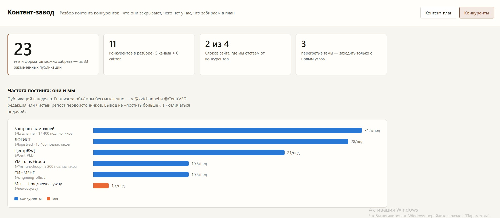

# Контент-завод

Система производства офферов и публикации контента по площадкам и аудиториям для проекта логистики из Китая.

## Структура

```
git_hub/
├── README.md              # этот файл — регламент работы
├── templates/             # готовые форматы офферов по площадкам
│   ├── offer-template.md  # универсальный шаблон (заголовок + текст + CTA)
│   ├── target-offers.md   # таргет: 3 аудитории
│   ├── context-offers.md  # контекст: 3 аудитории
│   └── seo-offers.md      # SEO: title/description/H1
├── audiences/             # карточки аудиторий (боли + офферы)
│   ├── urlica.md
│   ├── sellers.md
│   └── optoviki.md
├── content-log.md         # журнал публикаций
└── publish-checklist.md   # чек-лист публикования в репозиторий
```

## Как работает

1. Бери формат из `templates/` под нужную площадку.
2. Сверяйся с `audiences/` — оффер пишется под боли конкретной аудитории.
3. Готовый оффер фиксируй в `content-log.md` (дата, площадка, аудитория, статус).
4. Перед публикацией в репозиторий — пройди `publish-checklist.md`.

## Площадки и аудитории

- **Площадки:** таргет, контекст, SEO.
- **Аудитории:** юрлица, селлеры (маркетплейсы), оптовики.

## Метрики, под которые работает контент

Контент оценивается не по тексту, а по результату: лиды, CPL, CAC в разрезе площадок и аудиторий. Дешёвый лид — целевой, дорогой — кандидат на отключение или переработку оффера.
